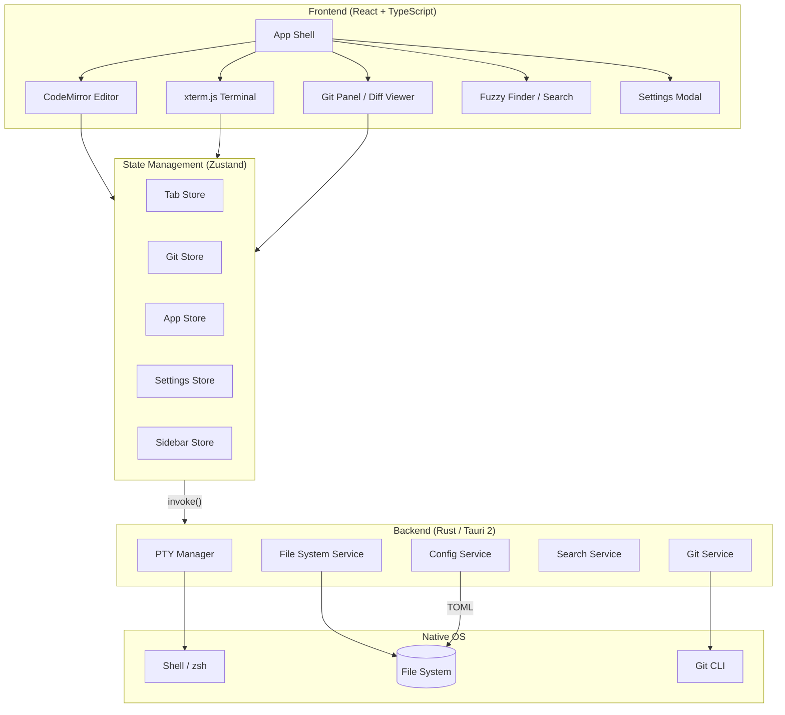

<p align="center">
  
</p>
<h1 align="center" style="font-weight: bold">Vibe Editor</h1>

A terminal-first, native macOS code editor built with Tauri 2. Vibe Editor combines a Rust-powered backend for PTY management, file system operations, and Git integration with a React + TypeScript frontend featuring CodeMirror editing, xterm.js terminals, and a fully themeable UI with real window transparency.

    

## Features

- **Integrated terminal** — Native PTY via `portable-pty` with xterm.js + WebGL rendering
- **Code editor** — CodeMirror 6 with syntax highlighting for JavaScript, TypeScript, HTML, CSS, Python, Rust, and JSON
- **Full Git integration** — Status, stage/unstage, commit, push/pull, branches, merge, rebase, stash, and diff viewer
- **Fuzzy file finder** — Fast subsequence-matching file search (⌘P)
- **Workspace text search** — Grep-style content search across files (⌘⇧F)
- **Split panes** — Vertical and horizontal editor/terminal splits
- **6 color themes** — One Dark, Abyss, GitHub Dark, Dracula, Monokai, GitHub Light
- **Window transparency** — Adjustable opacity with native macOS vibrancy
- **File system watcher** — Real-time directory change detection via `notify`
- **Persistent config** — Settings stored in `~/.config/vibe-editor/config.toml`
- **Recent projects** — Quick access to previously opened workspaces

## Architecture



## Prerequisites

| Tool   | Version   | Notes                                |
| ------ | --------- | ------------------------------------ |
| Node.js | >= 18     | For frontend build                  |
| Rust   | stable    | For Tauri backend compilation        |
| Tauri CLI | >= 2   | `npm run tauri` or `cargo install tauri-cli` |
| Git    | >= 2.x    | Required at runtime for Git features |
| macOS  | >= 12     | Uses macOS private APIs for vibrancy |

## Getting Started

### 1. Clone and install

```bash
git clone <repo-url>
cd vibe-editor
npm install
```

### 2. Run in development mode

```bash
npm run tauri dev
```

This starts the Vite dev server on `http://localhost:1420` and launches the Tauri window with hot-reload.

### 3. Build for production

```bash
npm run tauri build
```

Produces a native `.app` bundle in `src-tauri/target/release/bundle/`.

## Configuration

Settings are persisted to `~/.config/vibe-editor/config.toml`:

| Key                | Type     | Default                              | Description                      |
| ------------------ | -------- | ------------------------------------ | -------------------------------- |
| `sidebar_position` | `string` | `"left"`                             | Sidebar placement (`left`/`right`) |
| `sidebar_visible`  | `bool`   | `true`                               | Sidebar visibility on launch     |
| `font_size`        | `u16`    | `14`                                 | Editor font size in px           |
| `font_family`      | `string` | `"SF Mono, Menlo, Monaco, monospace"` | Editor font family              |
| `border_radius`    | `u16`    | `10`                                 | Window corner radius in px       |
| `app_opacity`      | `f64`    | `1.0`                                | Window opacity (0.0–1.0)         |
| `color_theme`      | `string` | `"midnight"`                         | Active color theme ID            |
| `recent_projects`  | `array`  | `[]`                                 | Up to 10 recent project paths    |

## Keyboard Shortcuts

| Shortcut   | Action                     |
| ---------- | -------------------------- |
| `⌘O`       | Open folder                |
| `⌘P`       | Fuzzy file finder          |
| `⌘B`       | Toggle sidebar             |
| `⌘,`       | Open settings              |
| `⌘T`       | New terminal tab           |
| `⌘W`       | Close current tab          |
| `⌘\`       | Split vertical             |
| `⌘⇧\`     | Split horizontal           |
| `⌘⇧F`     | Focus search panel         |
| `⌘⇧G`     | Focus Git panel            |
| `⌘1`–`⌘9` | Focus tab group by index   |

## Development

### Project structure

```
vibe-editor/
├── src/                    # React frontend
│   ├── components/         # UI components (AppShell, EditorTab, TerminalTab, etc.)
│   ├── store/              # Zustand state stores
│   ├── hooks/              # Custom React hooks (PTY, file system, Git diff)
│   ├── styles/             # Global CSS
│   ├── editor-themes.ts    # CodeMirror theme mappings
│   └── types.ts            # Shared TypeScript types
├── src-tauri/              # Rust backend
│   ├── src/
│   │   ├── lib.rs          # Tauri command handlers
│   │   ├── pty_manager.rs  # PTY lifecycle management
│   │   ├── fs_service.rs   # File I/O and directory watcher
│   │   ├── git_service.rs  # Git operations via CLI
│   │   ├── search.rs       # Fuzzy and text search
│   │   └── config.rs       # TOML config persistence
│   └── tauri.conf.json     # Tauri app configuration
├── index.html              # Vite entry point
├── vite.config.ts          # Vite configuration
└── package.json            # Frontend dependencies and scripts
```

### Available scripts

```bash
npm run dev        # Start Vite dev server
npm run build      # TypeScript check + Vite production build
npm run preview    # Preview production build
npm run tauri dev  # Full Tauri development mode (frontend + backend)
npm run tauri build # Production build with native packaging
```

### Running Rust tests

```bash
cd src-tauri
cargo test
```

## Recommended IDE Setup

- [VS Code](https://code.visualstudio.com/) + [Tauri](https://marketplace.visualstudio.com/items?itemName=tauri-apps.tauri-vscode) + [rust-analyzer](https://marketplace.visualstudio.com/items?itemName=rust-lang.rust-analyzer)
